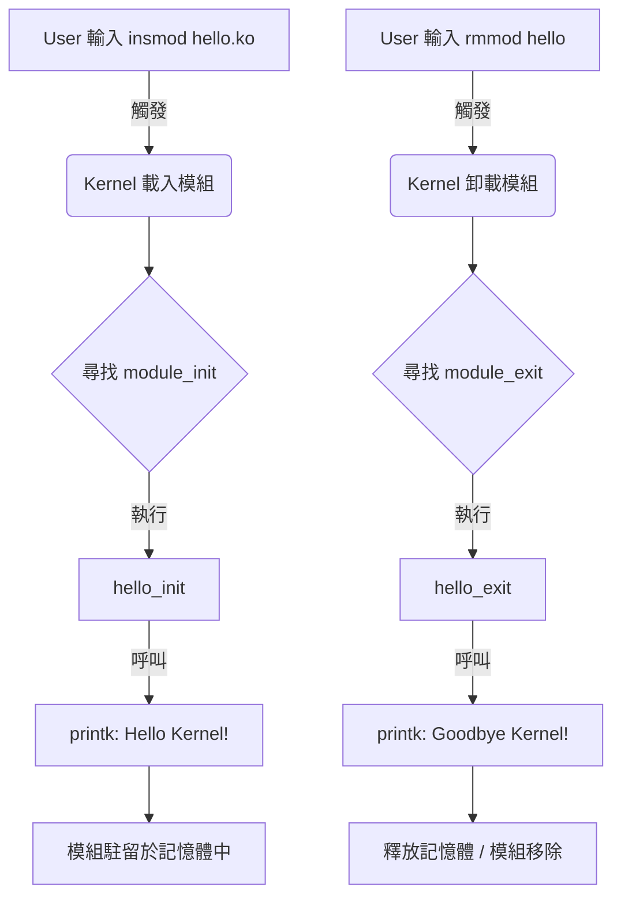

# 01 - Hello World Kernel Module 👋

這是驅動程式開發的第一課。
就像學習任何程式語言一樣，我們從印出 "Hello World" 開始。
但在核心 (Kernel) 世界裡，這個簡單的動作背後，隱藏著作業系統最基礎的運作機制。

## 為什麼要寫這個？ (Why?)

一般的應用程式 (Application) 有 `main()` 函數作為起點，執行完就結束。
但 **核心模組 (Kernel Module)** 不一樣，它不是「跑完就停」的程式，而是「註冊進去等待被呼叫」的**服務**。

這個範例教會我們三件最重要的事：
1.  **模組的生與死**：如何告訴核心「我來了 (`init`)」以及「我走了 (`exit`)」。
2.  **核心日誌 (`printk`)**：在核心裡沒有螢幕輸出 (`printf`)，我們必須把訊息寫入系統日誌。
3.  **核心編譯系統 (Kbuild)**：驅動程式必須配合核心的規則來編譯，不能自己隨便用 `gcc`。

## 程式碼解析 (Code Explanation)

```c
#include <linux/init.h>   // 定義模組的初始化與卸載巨集
#include <linux/module.h> // 核心模組必備的 header
#include <linux/kernel.h> // 包含 printk

// --- 1. 身份證 (Metadata) ---
// 這不是註解，而是給核心看的。
// 如果沒宣告 GPL，核心會把這個模組標記為 "Tainted" (受汙染)，
// 意味著如果系統崩潰，開發者可能不會受理 Bug Report。
MODULE_LICENSE("GPL");
MODULE_AUTHOR("Frank Huang");
MODULE_DESCRIPTION("A simple Hello World Kernel Module");

// --- 2. 入口函數 (Initialization) ---
// 當你執行 `insmod hello.ko` 時，核心會呼叫這個函數。
// __init 是一個修飾詞，告訴核心：
// 「這個函數只在初始化時用一次，執行完後請把這段程式碼佔用的記憶體釋放掉。」
// 這顯示了核心對記憶體使用的斤斤計較。
static int __init hello_init(void) {
    printk(KERN_INFO "Hello, Kernel! I am Frank's driver.\n");
    return 0; // 回傳 0 表示成功。如果回傳負值，模組載入會失敗。
}

// --- 3. 出口函數 (Cleanup) ---
// 當你執行 `rmmod hello` 時，核心會呼叫這個函數。
// 這裡非常重要！如果你在 init 裡申請了記憶體或硬體資源，
// 一定要在這裡還回去，否則會造成 Memory Leak，直到下次重開機前都無法復原。
static void __exit hello_exit(void) {
    printk(KERN_INFO "Goodbye, Kernel! Logging out.\n");
}

// --- 4. 註冊 (Registration) ---
// 告訴核心，哪一個函數是起點，哪一個是終點。
module_init(hello_init);
module_exit(hello_exit);
```

## 程式運作流程圖 (Execution Flow)



### 流程說明：
1.  **載入階段 (Load)**：當你執行 `insmod` 時，核心會將你的 `.ko` 檔讀入記憶體，並尋找標記為 `module_init` 的函數來執行。這就是你的進入點。
2.  **駐留階段 (Resident)**：執行完 `init` 後，模組不會消失，它會留在核心空間裡（雖然這個 Hello World 範例沒做什麼事，但如果是驅動程式，這時候就是在待命了）。
3.  **卸載階段 (Unload)**：當你執行 `rmmod` 時，核心會呼叫 `module_exit` 標記的函數，讓你做最後的清理（如釋放記憶體），然後將模組從核心移除。

## 如何測試 (How to Test)

1.  **編譯程式碼 (Build)**
    使用專案內的 Makefile 進行編譯。
    ```bash
    make
    ```
    *(預期結果：產生 `hello.ko` 檔案)*

2.  **載入模組 (Load)**
    使用 `insmod` 指令將模組插入核心。
    ```bash
    sudo insmod hello.ko
    ```

3.  **檢查輸出 (Verify)**
    `printk` 的訊息不會直接顯示在終端機，必須查看 Kernel Ring Buffer。
    ```bash
    sudo dmesg | tail
    ```
    *(預期結果：看到 `[ ... ] Hello, Kernel! I am Frank's driver.`)*

4.  **檢查模組狀態 (Check Status)**
    確認模組是否真的在核心清單中。
    ```bash
    lsmod | grep hello
    ```

5.  **卸載模組 (Unload)**
    使用 `rmmod` 指令移除模組。
    ```bash
    sudo rmmod hello
    ```

6.  **再次檢查輸出 (Final Check)**
    確認卸載訊息已印出。
    ```bash
    sudo dmesg | tail
    ```
    *(預期結果：看到 `[ ... ] Goodbye, Kernel! Logging out.`)*

7.  **清理暫存檔 (Clean)**
    移除編譯產生的中間檔案。
    ```bash
    make clean
    ```
