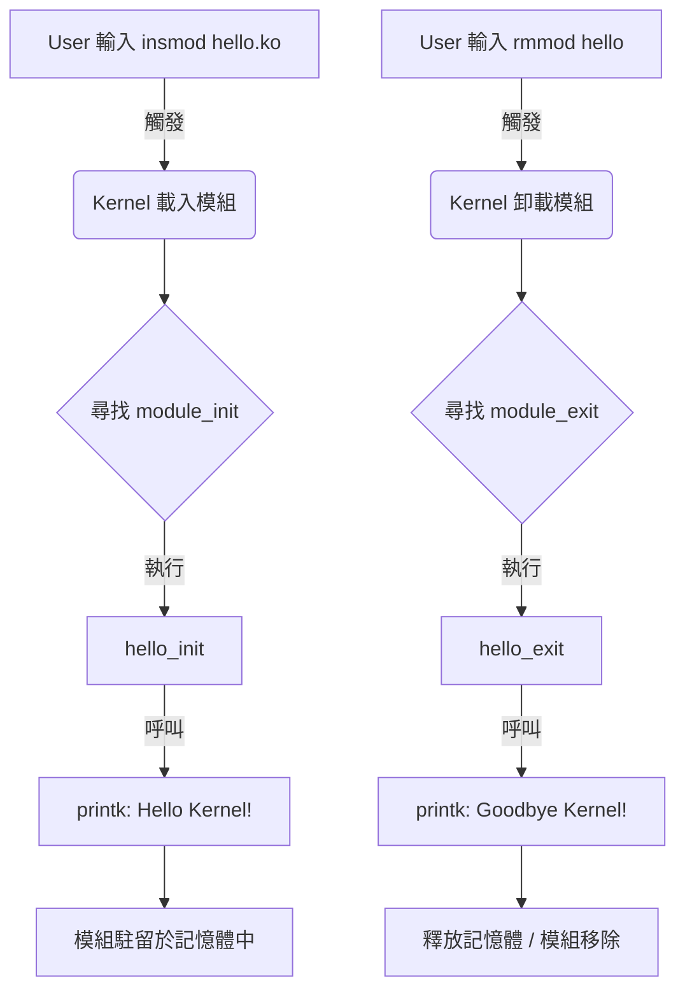

# 01 - Hello World Kernel Module 👋

這是驅動程式開發的第一課。
就像學習任何程式語言一樣，我們從印出 "Hello World" 開始。
但在核心 (Kernel) 世界裡，這個簡單的動作背後，隱藏著作業系統最基礎的運作機制。

## 為什麼要寫這個？ (Why?)

一般的應用程式 (Application) 有 `main()` 函數作為起點，執行完就結束。
但 **核心模組 (Kernel Module)** 不一樣，它不是「跑完就停」的程式，而是「註冊進去等待被呼叫」的**服務**。

這個範例教會我們三件最重要的事：
1.  **模組的生與死**：如何告訴核心「我來了 (`init`)」以及「我走了 (`exit`)」。
2.  **核心日誌 (`printk`)**：在核心裡沒有螢幕輸出 (`printf`)，我們必須把訊息寫入系統日誌。
3.  **核心編譯系統 (Kbuild)**：驅動程式必須配合核心的規則來編譯，不能自己隨便用 `gcc`。

## 程式碼解析 (Code Explanation)

```c
#include <linux/init.h>   // 定義模組的初始化與卸載巨集
#include <linux/module.h> // 核心模組必備的 header
#include <linux/kernel.h> // 包含 printk

// ... (Metadata 省略)

// --- 2. 入口函數 (Initialization) ---
static int __init hello_init(void) {
    printk(KERN_INFO "Hello, Kernel! I am Frank's driver.\n");
    return 0;
}

// --- 3. 出口函數 (Cleanup) ---
static void __exit hello_exit(void) {
    printk(KERN_INFO "Goodbye, Kernel! Logging out.\n");
}

module_init(hello_init);
module_exit(hello_exit);
```

## 程式運作流程圖 (Execution Flow)



### 流程說明：
1.  **載入階段 (Load)**：當你執行 `insmod` 時，核心會將你的 `.ko` 檔讀入記憶體，並尋找標記為 `module_init` 的函數來執行。這就是你的進入點。
2.  **駐留階段 (Resident)**：執行完 `init` 後，模組不會消失，它會留在核心空間裡（雖然這個 Hello World 範例沒做什麼事，但如果是驅動程式，這時候就是在待命了）。
3.  **卸載階段 (Unload)**：當你執行 `rmmod` 時，核心會呼叫 `module_exit` 標記的函數，讓你做最後的清理（如釋放記憶體），然後將模組從核心移除。

## 如何測試 (How to Test)
(略，同前版)
