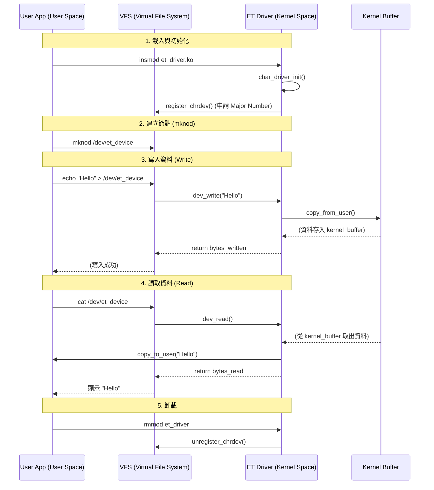

# 02 - Character Device Driver (The Echo Device) 🗣️

這是一個基礎的字元驅動程式 (Character Driver) 範例。
它展示了如何註冊一個裝置，並實作 `open`, `read`, `write`, `release` 等核心介面。

## 為什麼要這樣寫？ (The "Why")

你可能會覺得困惑，為什麼要寫這麼多 `file_operations`？為什麼不能像寫 C 語言一樣直接讀寫？

### 1. 核心的觀點：「一切皆檔案」
在 Linux 中，應用程式 (User App) 不知道什麼是 LED、什麼是馬達。它只知道 **「檔案」**。
它對所有東西的操作都只有四招：
- `open()`: 打開檔案
- `read()`: 讀資料
- `write()`: 寫資料
- `close()`: 關閉檔案

所以，驅動程式的任務，就是**「欺騙」**應用程式。
應用程式以為它在寫檔案，但實際上我們在驅動程式裡攔截了這個寫入動作，並把它轉變成硬體操作。

### 2. file_operations (fops)
這就是那個「攔截表」。
```c
static struct file_operations fops = {
    .read = dev_read,    // 當用戶呼叫 read() 時，請執行我的 dev_read()
    .write = dev_write,  // 當用戶呼叫 write() 時，請執行我的 dev_write()
    ...
};
```
如果沒有這個表，用戶對你的裝置寫資料時，核心不知道該怎麼辦，就會報錯。

### 3. copy_to_user / copy_from_user
為什麼不能用 `memcpy`？
因為 **User Space (用戶)** 和 **Kernel Space (核心)** 的記憶體是完全隔離的兩個世界（虛擬記憶體位址不同）。
- 用戶傳來的指標 (pointer)，在核心眼裡可能是無效的，或者是惡意程式故意傳一個核心的記憶體位址想來竊取資料。
- `copy_from_user` 是一個帶有安全檢查的搬運工，它會確保：
    1. 這個位址真的屬於該用戶。
    2. 搬運過程中如果發生錯誤 (Page Fault)，能安全處理而不讓核心崩潰。

### 4. Major Number (主設備號)
這就像是裝置的「身分證字號」。
當你在 `/dev` 建立檔案時，檔案系統只認這個號碼。
當用戶打開 `/dev/et_device` 時，核心會看它的 Major Number (例如 243)，然後去查表：「喔，243 號是 Frank 的驅動程式」，然後把控制權交給你。

## 程式運作流程圖 (Execution Flow)



### 流程說明：
1.  **註冊 (Registration)**：驅動程式啟動時，向核心（VFS）掛號，說：「我是驅動程式，我負責 Major Number 243，如果有對應的操作請轉交給我。」
2.  **寫入 (Write Path)**：
    *   用戶 `echo` -> 觸發 `sys_write` 系統呼叫。
    *   核心看到是針對我們的裝置，於是轉呼叫 `dev_write`。
    *   我們用 `copy_from_user` 把資料從用戶搬進核心的暫存區 (`kernel_buffer`)。
3.  **讀取 (Read Path)**：
    *   用戶 `cat` -> 觸發 `sys_read` 系統呼叫。
    *   核心轉呼叫 `dev_read`。
    *   我們用 `copy_to_user` 把暫存區的資料搬回給用戶。

## 如何測試 (How to Test)

### 1. 編譯 (Build)
```bash
make
```

### 2. 載入模組 (Load)
```bash
sudo insmod et_driver.ko
```

### 3. 尋找主設備號 (Find Major Number)
核心會動態分配一個號碼，請檢查 Log：
```bash
dmesg | tail
```
你會看到類似這樣的訊息：
> ET: Registered correctly with major number **243**

### 4. 建立裝置節點 (Create Device Node)
使用剛剛找到的號碼 (假設是 243) 來建立檔案：
```bash
# sudo mknod /dev/[名稱] c [Major] [Minor]
sudo mknod /dev/et_device c 243 0

# 開放權限讓一般用戶也能讀寫
sudo chmod 666 /dev/et_device
```

### 5. 互動測試 (Interact)
現在 `/dev/et_device` 就是你的裝置了！

**寫入資料：**
```bash
echo "Hello Kernel!" > /dev/et_device
```

**讀取資料：**
```bash
cat /dev/et_device
# Output: Hello Kernel!
```

**查看核心運作紀錄：**
```bash
dmesg | tail
# 你會看到驅動程式印出的:
# ET: Received 14 characters from the user
# ET: Sent 14 characters to the user
```

### 6. 卸載與清理 (Clean Up)
```bash
sudo rm /dev/et_device
sudo rmmod et_driver
```
