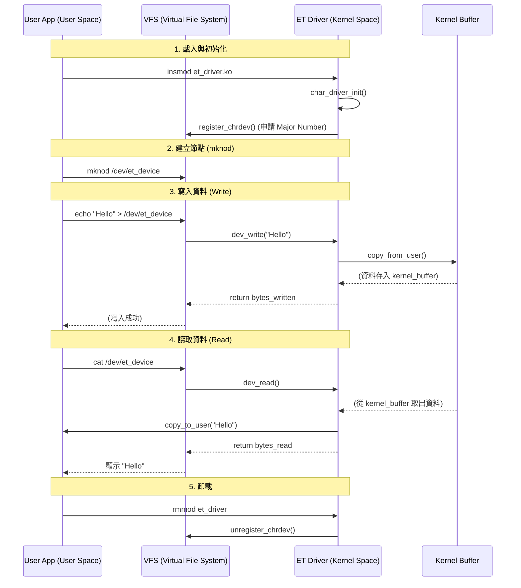

# 02 - Character Device Driver (The Echo Device) 🗣️

這是一個基礎的字元驅動程式 (Character Driver) 範例。
它展示了如何註冊一個裝置，並實作 `open`, `read`, `write`, `release` 等核心介面。

## 為什麼要這樣寫？ (The "Why")

(略，保留原本的說明)

## 程式運作流程圖 (Execution Flow)

### 流程說明：
1.  **註冊 (Registration)**：驅動程式啟動時，向核心（VFS）掛號，說：「我是驅動程式，我負責 Major Number 243，如果有對應的操作請轉交給我。」
2.  **寫入 (Write Path)**：
    *   用戶 `echo` -> 觸發 `sys_write` 系統呼叫。
    *   核心看到是針對我們的裝置，於是轉呼叫 `dev_write`。
    *   我們用 `copy_from_user` 把資料從用戶搬進核心的暫存區 (`kernel_buffer`)。
3.  **讀取 (Read Path)**：
    *   用戶 `cat` -> 觸發 `sys_read` 系統呼叫。
    *   核心轉呼叫 `dev_read`。
    *   我們用 `copy_to_user` 把暫存區的資料搬回給用戶。

## 如何測試 (How to Test)
(略，同前版)
