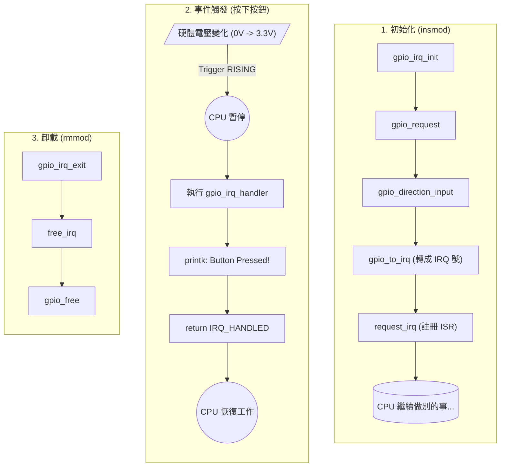

# 04 - GPIO Input Driver (Interrupts) 🔘

這堂課我們學習如何讀取硬體訊號。
但我們不使用「輪詢 (Polling)」——也就是寫一個迴圈一直問「按了沒？按了沒？」。
我們要使用更高效的 **中斷 (Interrupt)** 機制。

## 學習重點 (Key Concepts)

1.  **Interrupts (IRQ)**: 讓硬體主動通知 CPU。當按鈕按下時，CPU 會暫停當前工作，立刻執行我們的 `handler`。
2.  **gpio_to_irq**: 將 GPIO 編號轉換為 CPU 認得的中斷編號 (IRQ Number)。
3.  **request_irq**: 向核心註冊中斷服務程式 (ISR)。
4.  **Raspberry Pi 5 編號**: 繼續使用 RP1 的動態編號 (本例使用 GPIO 27 = 596)。

## 硬體接線 (Hardware Wiring)

請準備：
- 一個按鈕開關 (Push Button)
- 一個下拉電阻 (10kΩ) 
  *(如果不使用下拉電阻，按鈕放開時腳位會浮動，導致不斷觸發雜訊)*

接線方式：
1.  **按鈕一端** -> 接 **3.3V** (Pin 1)
2.  **按鈕另一端** -> 接 **GPIO 27** (Pin 13)
3.  **GPIO 27** -> 透過 10kΩ 電阻 -> 接 **GND** (Pin 9 或 14)

*(這樣平時是 0V，按下按鈕變成 3.3V，觸發 RISING Edge)*

## 程式運作流程圖 (Execution Flow)



## 如何測試 (How to Test)

1.  **編譯**
    ```bash
    make
    ```

2.  **監控 Log (準備)**
    先開一個視窗跑監控，這樣才能即時看到按鈕反應。
    ```bash
    sudo dmesg -w
    ```

3.  **載入模組**
    在另一個視窗執行：
    ```bash
    sudo insmod gpio_input.ko
    ```
    *(你會看到 "The button is mapped to IRQ: xxx")*

4.  **按按鈕！**
    按下麵包板上的按鈕。
    查看 `dmesg` 視窗，應該會出現：
    > GPIO_IRQ: Interrupt! (Button Pressed 1 times)
    > GPIO_IRQ: Interrupt! (Button Pressed 2 times)

5.  **查看系統中斷表 (進階)**
    你可以看看系統對這個中斷的統計：
    ```bash
    cat /proc/interrupts | grep my_button
    ```
    你會看到觸發次數的統計。

6.  **卸載**
    ```bash
    sudo rmmod gpio_input
    ```

## 常見問題
- **按一次卻跳好幾次訊息？**
    這是 **機械彈跳 (Debouncing)** 現象。真實的按鈕在接觸瞬間會產生微小的火花與震動，導致訊號在短時間內 0/1 亂跳。
    解決方法通常是在程式中加入去彈跳邏輯 (Debounce Logic)，或是在硬體上並聯電容。本範例為了簡化，未處理此現象。
