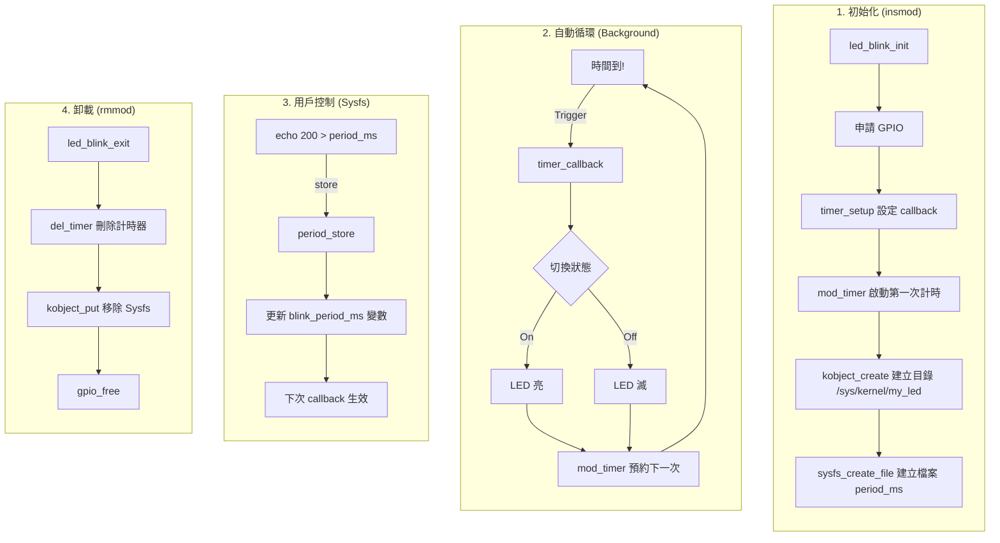

# 05 - LED Blinking Driver (Timers & Sysfs) ⏳

這堂課我們讓 LED 「活起來」。
不再需要手動一直輸入 `echo 1`，驅動程式會自己計時並切換開關。
同時，我們引入了現代 Linux 驅動控制參數的標準介面：**Sysfs**。

## 為什麼要用 Sysfs？ (/dev vs /sys)

您可能會疑惑：*「為什麼不繼續用 `/dev/my_led` 就好？為什麼要搞一個 `/sys/kernel/my_led`？」*

這是 Linux 核心設計哲學的重要分界：
1.  **`/dev` (Device Nodes)**：
    *   用途：**傳輸資料 (Data Flow)**。
    *   就像水管一樣，適合 `read`/`write` 大量的資料流（例如聲音、影像、感測器數據）。
    *   缺點：不適合用來「設定參數」。如果你想改變採樣頻率，難道要寫一個特殊的字串 "SET_FREQ=100" 進去嗎？這樣很難標準化。

2.  **`/sys` (Sysfs)**：
    *   用途：**控制屬性 (Attributes/Control)**。
    *   它將核心內部的變數（如 `blink_period_ms`）映射成一個**純文字檔案**。
    *   讀取檔案 = 讀取變數；寫入檔案 = 修改變數。
    *   這讓 Shell Script 或其他程式可以非常容易地調整驅動程式的行為，而不需要寫複雜的 ioctl 程式。

在本範例中，**閃爍**是自動發生的（這是行為），而**閃爍頻率**是一個參數（這是屬性），所以用 Sysfs 來控制頻率是最標準的做法。

## 核心原理：如何建立 Sysfs？

建立 Sysfs 介面通常分為三個步驟，這在 `led_blink.c` 中都有體現：

### 1. 建立 Kobject (目錄)
```c
// 在 /sys/kernel/ 下建立一個名為 "my_led" 的資料夾
my_kobj = kobject_create_and_add("my_led", kernel_kobj);
```
這會在系統中產生路徑：`/sys/kernel/my_led/`。

### 2. 定義屬性 (Attribute)
我們需要告訴核心，這個目錄下有哪些檔案，以及這些檔案對應到哪些讀寫函數。
```c
// 定義一個名為 "period_ms" 的屬性，權限 0666
// 讀取時呼叫 period_show，寫入時呼叫 period_store
static struct kobj_attribute period_attr = __ATTR(period_ms, 0666, period_show, period_store);
```

### 3. 實作讀寫函數 (Show & Store)
這是 Sysfs 的靈魂。
*   **Show (讀)**：核心把 buffer 給你，你把變數值 `sprintf` 進去。
    ```c
    ssize_t period_show(...) {
        return sprintf(buf, "%d\n", blink_period_ms);
    }
    ```
*   **Store (寫)**：核心把用戶寫的字串給你，你用 `kstrtoint` 轉成整數並存回變數。
    ```c
    ssize_t period_store(...) {
        kstrtoint(buf, 10, &new_period);
        blink_period_ms = new_period; // 更新變數，下次閃爍生效
    }
    ```

## 程式運作流程圖 (Execution Flow)



## 如何測試 (How to Test)

1.  **編譯與載入**
    ```bash
    make
    sudo insmod led_blink.ko
    ```
    *(載入後，您的 LED 應該會開始每秒閃爍一次)*

2.  **查看 Sysfs 介面**
    ```bash
    ls -l /sys/kernel/my_led/
    # 應該會看到一個檔案: period_ms
    ```

3.  **讀取目前速度**
    ```bash
    cat /sys/kernel/my_led/period_ms
    # Output: 1000
    ```

4.  **改變速度 (變快！)**
    讓它變成 0.1 秒閃一次：
    ```bash
    sudo sh -c 'echo 100 > /sys/kernel/my_led/period_ms'
    ```
    *(注意：因為權限問題，直接用 `sudo echo` 可能會失敗，建議用 `sudo sh -c` 或先切換成 root)*

5.  **改變速度 (變慢～)**
    讓它變成 2 秒閃一次：
    ```bash
    sudo sh -c 'echo 2000 > /sys/kernel/my_led/period_ms'
    ```

6.  **卸載**
    ```bash
    sudo rmmod led_blink
    ```
    *(LED 應該會熄滅停止)*
