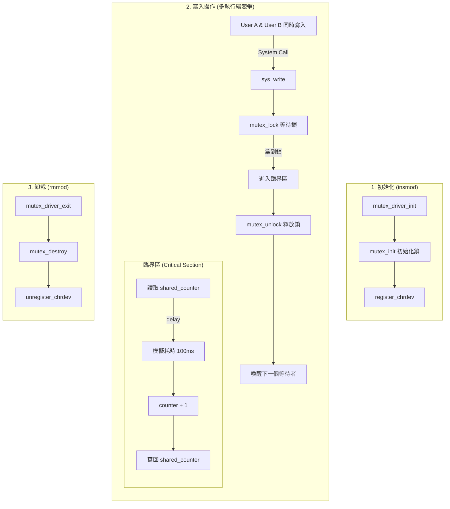

# 06 - Mutex Locking (Concurrency Control) 🔒

這堂課我們探討驅動程式開發中最危險也最重要的一環：**並發控制 (Concurrency)**。
當多個執行緒（Thread）同時存取同一個變數時，如果沒有適當的保護，就會發生 **Race Condition (競態條件)**，導致資料損壞。

我們使用 **Mutex (互斥鎖)** 來解決這個問題。

## 學習重點 (Key Concepts)

1.  **Race Condition**: 當兩個執行緒同時執行 `i++`，結果可能只加了 1，而不是 2。
2.  **Critical Section (臨界區)**: 不能同時被兩個人執行的程式碼區塊。
3.  **Mutex API**:
    *   `mutex_init(&lock)`: 初始化鎖。
    *   `mutex_lock(&lock)`: 拿鎖。如果拿不到（被別人拿走），程式會**休眠 (Sleep)** 等待。
    *   `mutex_unlock(&lock)`: 還鎖。喚醒正在排隊的人。

## 程式運作流程圖 (Execution Flow)



## 如何測試 (How to Test)

### 1. 編譯與載入
```bash
make
sudo insmod mutex_driver.ko
```

### 2. 建立裝置節點
先查看 Major Number：
```bash
dmesg | tail
# 假設是 244
```
建立節點：
```bash
sudo mknod /dev/race_car c 244 0
sudo chmod 666 /dev/race_car
```

### 3. 單人測試 (Base Case)
寫入一次，看看數值對不對。
```bash
echo "Run" > /dev/race_car
cat /dev/race_car
# Output: Counter: 1
```

### 4. 多人競爭測試 (Stress Test)
開啟兩個終端機視窗，準備讓它們**同時**寫入。
或者使用這個單行指令，一次開 10 個執行緒轟炸它：
```bash
for i in {1..10}; do echo "Hit" > /dev/race_car & done
```

**觀察結果：**
1.  執行 `cat /dev/race_car`。
2.  如果 Mutex 有效，最後的 Counter 應該是 **11** (1次單人 + 10次轟炸)。
3.  你可以看 `dmesg`，你會發現即使它們是同時啟動的，但在 Log 裡它們是**排隊**進入的 (Lock acquired -> Updated -> Lock acquired...)。

### 5. 實驗：如果拿掉鎖會怎樣？
你可以試著把 `mutex_lock` 和 `mutex_unlock` 註解掉，重新編譯並跑上面的測試。
你會發現 Counter 的數字會**小於 11**，這就是 Race Condition！
